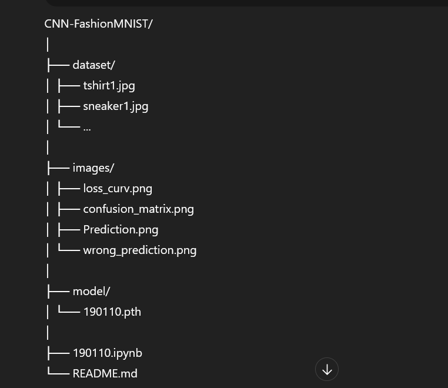
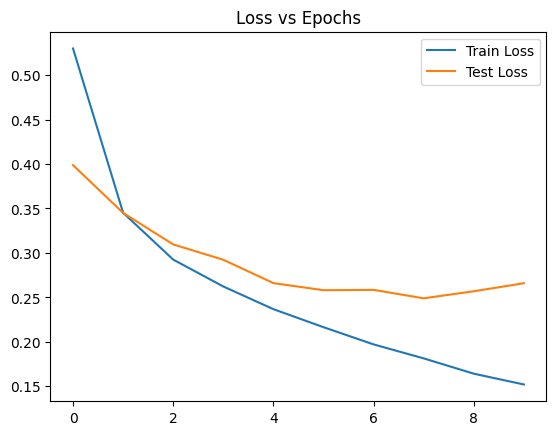
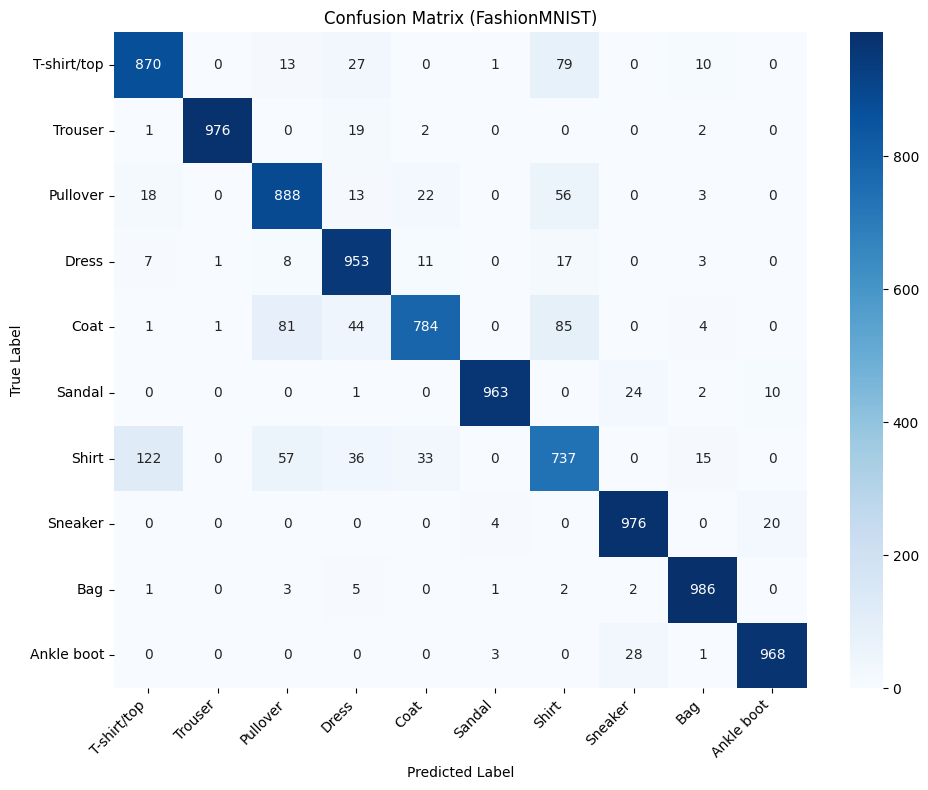
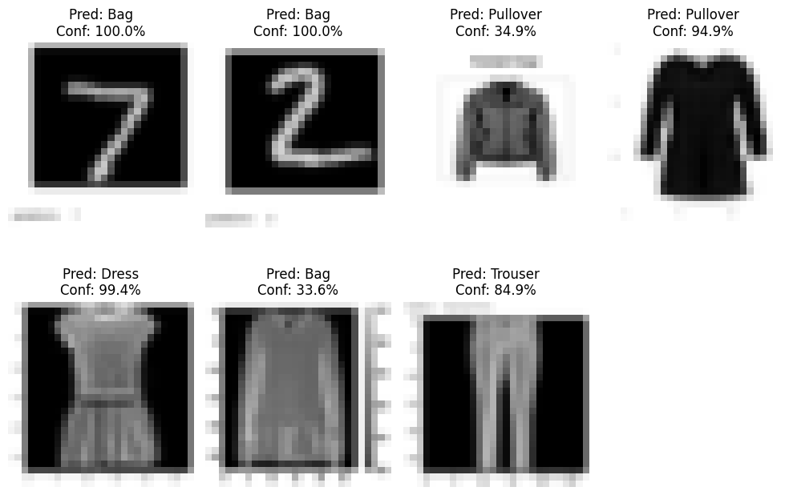
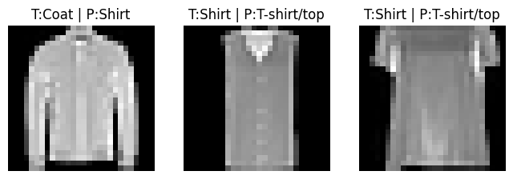

# CNN Image Classification using FashionMNIST (PyTorch)

## Project Overview
This project implements a **Convolutional Neural Network (CNN)** using **PyTorch** to classify images from the **FashionMNIST** dataset.  
The trained model is further evaluated on **real-world smartphone images**, bridging the gap between benchmark datasets and practical usage.

The complete workflow is designed to be **fully reproducible** using **Google Colab**, with no manual file uploads required during execution.

---

## Dataset Description

### 1. Standard Dataset
- **Name:** FashionMNIST  
- **Source:** `keras.datasets.fashion_mnist`  
- **Image Size:** 28 × 28 pixels  
- **Channels:** Grayscale (1 channel)  
- **Number of Classes:** 10  

### 1. Standard Dataset
- **Name:** FashionMNIST  
- **Source:** `keras.datasets.fashion_mnist`
- **Image Size:** 28 × 28 pixels
- **Channels:** Grayscale (1 channel)
- **Number of Classes:** 10

### Class Labels

### 2. Custom Real-World Images
- 10 images captured using a **smartphone**
- Objects correspond to FashionMNIST classes (e.g., T-shirt, Sneaker, Bag)
- Plain background to reduce noise
- Stored in the `dataset/` directory

All custom images are:
- Converted to **grayscale**
- Resized to **28 × 28**
- Normalized to match the training data distribution

---

## Repository Structure

  

---

## Data Preprocessing
- Pixel values normalized to **[0, 1]**
- Reshaped from `(28, 28)` → `(1, 28, 28)`
- Converted to PyTorch tensors
- Same preprocessing pipeline applied to **both dataset and phone images**

---

## CNN Architecture

| Layer Type | Description |
|-----------|-------------|
| Conv2D | 32 filters, 3×3 kernel |
| ReLU | Activation |
| MaxPooling | 2×2 |
| Conv2D | 64 filters, 3×3 kernel |
| ReLU | Activation |
| MaxPooling | 2×2 |
| Fully Connected | 128 neurons |
| Output Layer | 10 classes |

- **Loss Function:** CrossEntropyLoss  
- **Optimizer:** Adam  
- **Framework:** PyTorch  

---

## Model Training
- Batch size: 64  
- Epochs: 5  
- Training and validation accuracy tracked  
- Loss and accuracy visualized per epoch  

---

## Evaluation & Results

### ✔ Training Loss Curve

  

### ✔ Confusion Matrix

  

### ✔ Real-World Predictions

  

### ✔ Visual Error Analysis (Wrong Predictions)

  

---

## Real-World Prediction
The trained CNN is used to classify **custom smartphone images**.

For each image, the notebook displays:
- The image
- Predicted class name
- Confidence percentage

---
## Model Observations & Analysis

- **High confidence (≈99–100%)** is observed for images closely matching the FashionMNIST training distribution, particularly for classes such as **Bag** and **Dress**.

- Some correctly classified samples (e.g., **Pullover**, **Trouser**) show **moderate confidence (≈35%–85%)**, indicating visual ambiguity due to similar textures, shapes, or lighting variations.

- The model is sensitive to **input quality**, where lower contrast, blurred edges, or non-uniform backgrounds lead to reduced confidence scores.

- Despite being trained exclusively on the FashionMNIST dataset, the CNN demonstrates **reasonable generalization** to real-world smartphone images after proper preprocessing.

- Visually similar classes (e.g., **Pullover**, **Coat**, **Dress**) exhibit partial feature overlap, resulting in lower confidence for some predictions.
